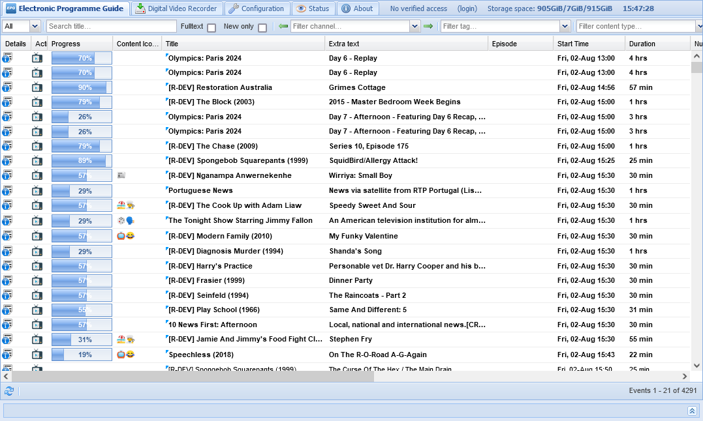
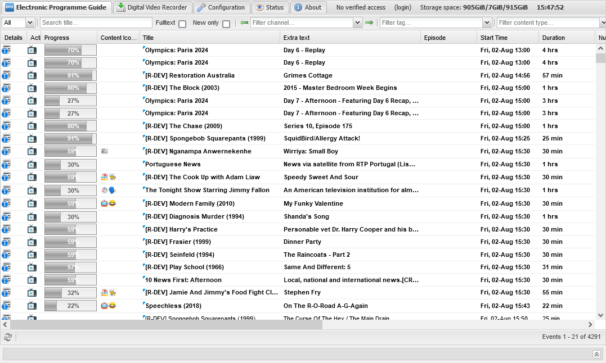
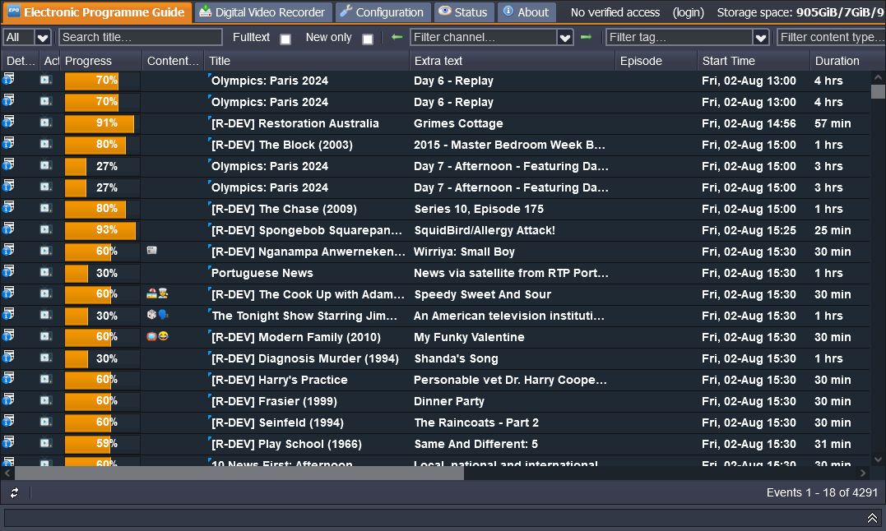

---
layout:
  title:
    visible: true
  description:
    visible: false
  tableOfContents:
    visible: true
  outline:
    visible: true
  pagination:
    visible: true
---

# Theme

There are three themes that can be used with the TVH Web User Interface.

From Configuration -> General -> Base, in the 'Web Interface Settings' panel, select one of the following themes from the drop‑down list.

## Blue (Default)

<figure><figcaption>
Sample 'Blue' Theme
</figcaption></figure>

## Grey

<figure><figcaption>
Sample 'Grey' Theme
</figcaption></figure>

## Access

<figure><figcaption>
Sample 'Access' Theme
</figcaption></figure>
