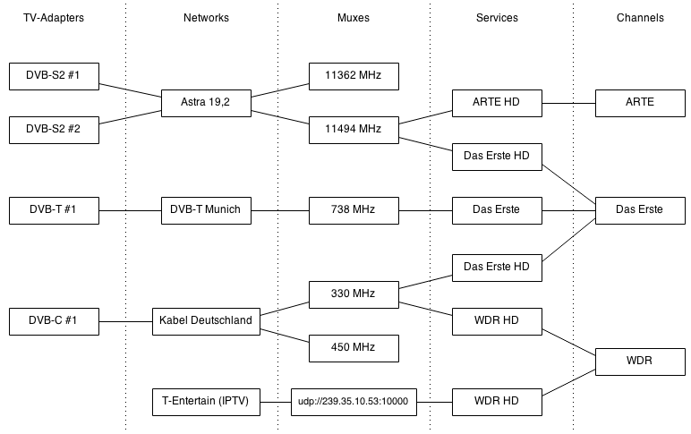

# Concepts

It helps to understand the basic software concepts for Tvheadend:

## Hardware & Software 

* **Tuner** is the chipset/hardware needed to interpret a digital television signal and extract from it the programme stream. Tuner hardware is also responsible for communicating with your satellite dish via the LNB when using DVB-S.
* **Driver** is software the operating system uses to talk to the tuner hardware. It can be built into the operating system, or might be something you need install, or even compile, separately.
* **Firmware** is binary microcode that the driver sends to the tuner on initialisation. Card firmware is closed-source software and can be a common cause of problems.

## Tvheadend 

* **Network** is a software definition of your carrier network that tells tuner hardware how and where to look for a signal, e.g. the network defines a such as DVB-T or DVB-S2, and how it is scanned, where the DVB-S satellite is in orbit, and similar.
* **Muxes** are channel frequencies that transmit multiple digital channel signals in the radio frequency space of a single analogue channel. Digitial signals are multiplexed (muxed) together to allow more channels to be broadcast.
* **Services** are the individual data streams on a Mux. They can be TV or Radio programmes, or they can provide data services such as digital teletext or catch-up IPTV services.
* **Channels** are mapped against Services. Channels are what client software access when users think _“I’d like to watch BBC One now, please”_.

Each configuration component supports _many-to-many_ relationships: meaning one component can be related to multiple components of the next type, and vice versa, e.g. one tuner can support multiple networks and one network can exist on multiple tuners.&#x20;

The following diagram explains the relationship between these components:

<figure><figcaption>
Tvheadend Adapter > Network > Mux > Service > Channel architecture
</figcaption></figure>

### Why The Complexity?

Simply, because 'BBC One' probably exists in multiple different places. It has regional variations on multiple frequencies (different services on different muxes) and if often accessible through more than one piece of hardware (two satellite tuners, or one satellite and one terrestrial tuner). When you select a channel to watch or record, Tvheadend needs to know the mapped path to the right service on the right mux .. to ask the right tuner to get the signal for you.
