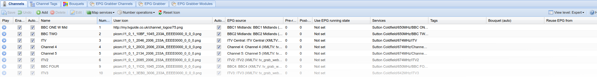



---

## Overview

This tab lists all defined channels.

You can play a stream by clicking the play icon. This will automatically launch an appropriate player, otherwise you will need to manually open the playlist to start watching (normally a double-click on the downloaded file).
Note, the links don't link to the actual stream but to a playlist for use with media players such as VLC, If you'd prefer to receive the raw stream instead, you can do so by removing the /play/ path from the URL - see URL Syntax for more info.

---

## Buttons



---
