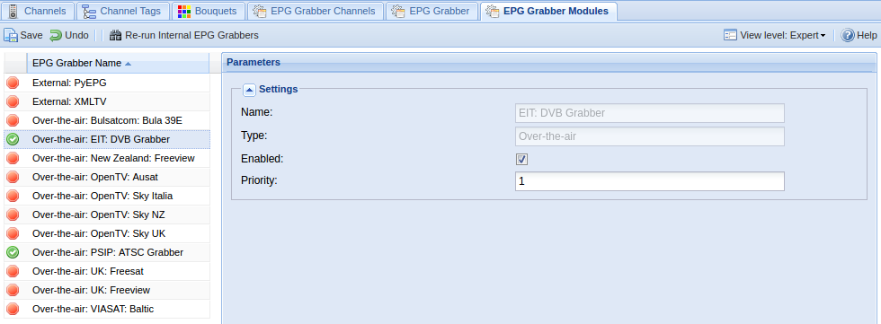



---

## Overview

This tab is used to configure the Electronic Program Guide (EPG) 
grabber modules. Tvheadend supports a variety of different EPG 
grabbing mechanisms. These fall into 3 broad categories, within which 
there are a variety of specific grabber implementations.



Type                                          | Description
----------------------------------------------|----------------------------
[Over-the-air (OTA)](class/epggrab_mod_ota)   | This type of grabber pulls EPG data directly from the broadcast signal.
[Internal XMLTV](class/epggrab_mod_int_xmltv) | This type of grabber executes an internal (local) [XMLTV](http://xmltv.org) grabber script & parses the output.
[External XMLTV](class/epggrab_mod_ext_xmltv) | This type of grabber reads EPG data from a socket pushed to it using an [XMLTV](http://xmltv.org) grabber script.
[Internal PyEPG](class/epggrab_mod_int_pyepg) | This type of grabber executes an internal (local) [PyEPG](https://github.com/adamsutton/PyEPG) grabber script & parses the output. This isn't widely used!
[External PyEPG](class/epggrab_mod_ext_pyepg) | This type of grabber reads EPG data from a socket pushed to it using an [PyEPG](https://github.com/adamsutton/PyEPG) grabber script. This isn't widely used!

---

## Buttons



---

## Notes

Only OTA EIT and PSIP (ATSC) grabbers are enabled by default. If 
you're missing EPG data, make sure to enable the correct grabber(s) 
for your location/provider. If you use more than one grabber, be sure 
to give a higher priority to the grabber that provides you with richer data.

Don't forget to set the *EIT time offset* for your network(s)!

### OTA Scrapper

Some OTA EIT grabber mechanisms support additional scraping options.

The OTA broadcast data often does not have specific dedicated fields
to describe the programme season, episode, etc. Sometimes this
information is included in the programme summary.

The scraper configuration files contains regular expressions to scrape
additional information from the broadcast information.  For example
the broadcast summary may include the text '(S10 E5)' and the
configuration file will extract this.

This scraping option does not access or retrieve details from the
Internet.

Currently only a limited number of configuration files are shipped and
these are located in the epggrab/eit/scrape directory.

If the "EIT: DVB Grabber" is used then typically you would enter the
configuration file (such as "uk") and enable relevant tickboxes to
enable the additional scraping.

If the scraper configuration is not enabled then the default behaviour
means broadcast information such as summary information will still be
retrieved.

---

### XMLTV XPath Examples and Notes

Although XMLTV is a standard, some providers of XMLTV data include additional information.
XPath-like expressions can be used to extract some of this additional information
for EPG grabbers that use XMLTV as a data source.


##Category Code

Some information providers include free form category descriptions
that are not compliant with the DVB EIT standard.

In the following example, 'Cricket' is not a standard DVB EIT category.
However, '0x40' is the standard code for 'Sport' and the provider has
added this code to allow the standard code to be used when needed.

```
<programme start="yyyymmddHHMMSS +0000" stop="yyyymmddHHMMSS +0000" channel="2">
    <category lang="en" eit="0x40">Cricket</category>
</programme>
```

To extract this attribute for use in TVH, we should add `@eit` to the
'Category Code XPath' field.  This will extract the hexadecimal code
'0x40' and convert that to the standard category code 'Sport'.

For the purposes of the category code, the root node is considered to be the
standard `category` node within `programme`.

##Unique Event Identifier

By default, XMLTV does not provide a mechanism for uniquely identifying each event.

In the following example, an XMLTV provider has added the non-standard `uniqueID`
attribute to the `programme` node.
```
<programme uniqueID="1234" start="yyyymmddHHMMSS +0000" stop="yyyymmddHHMMSS +0000" channel="2">
</programme>
```
To extract this attribute for use in TVH, we should add `@uniqueID` to the
'Unique Event ID XPath' field.  This will assign '1234' as the unique
identifier for this EPG event and will allow future updates matching
this ID to be applied.

For the purposes of the unique ID, the root node is considered to be `programme`.

##SeriesLink and EpisodeLink

A CRID (Content Reference IDentifier) is a mechanism used by broadcasters
to identify events from the same series and multiple occurrences
of the same episode in a series.  TVH refers to these as 'SeriesLink'
and 'EpisodeLink'.  These fields can be used for recording a whole series
or detecting a repeated episode.

In the following example, the provider has added the non-standard `crid` node to the XMLTV data.
This has been further broken down to include a `series` node and an `episode` node.

```
<programme uniqueID="1234" start="yyyymmddHHMMSS +0000" stop="yyyymmddHHMMSS +0000" channel="2">
      <crid>
            <series>crid://provider/abcde</series>
            <episode>crid://provider/abcde_98765</episode>
      </crid>
</programme>
```
To extract these values, we should add `//crid/series/text()` and `//crid/episode/text()`
to the 'SeriesLink XPath' and 'EpisodeLink XPath' fields respectively.

For the purposes of the SeriesLink and EpisodeLink, the root node is
considered to be `programme`.

##SeriesLink and EpisodeLink Fallbacks

If the XPath expression does not match any data and these options are enabled,
TVH will perform its standard process for creating 'SeriesLink' and
'EpisodeLink' values, otherwise, the fields will be left empty.

##Notes

TVH can only interpret the following subset of XPath identifier syntax:

/ = Node

@ = Attribute

[] = Condition

text() = Node text

**Example:** //node1/node2[attrX=value]/@attrY

---