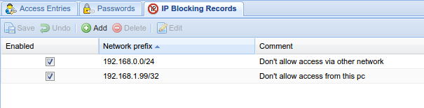



---



### Notes on IP Blocking

* You must enter a network prefix to block. For example, to block just `192.168.6.66`
enter `192.168.6.66/32` or to block the all addresses in the `192.168.6` range, enter
`192.168.6.0/24`.

* You can enter whatever you like in the comment field.

---

## Buttons


