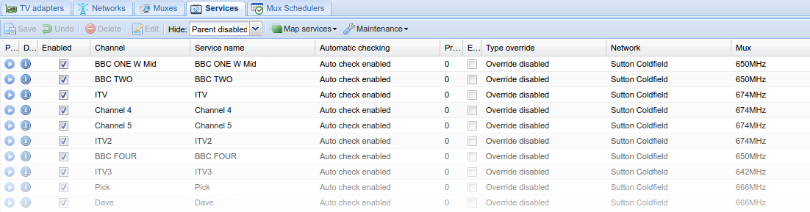
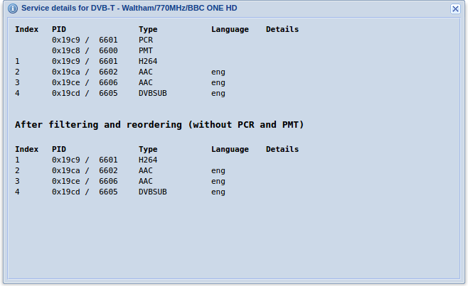



---

## Overview

Services are automatically pulled from muxes and can be mapped to Channels.



---

## Buttons



---

## Service Information

Clicking the  
information icon will display service details.

---
