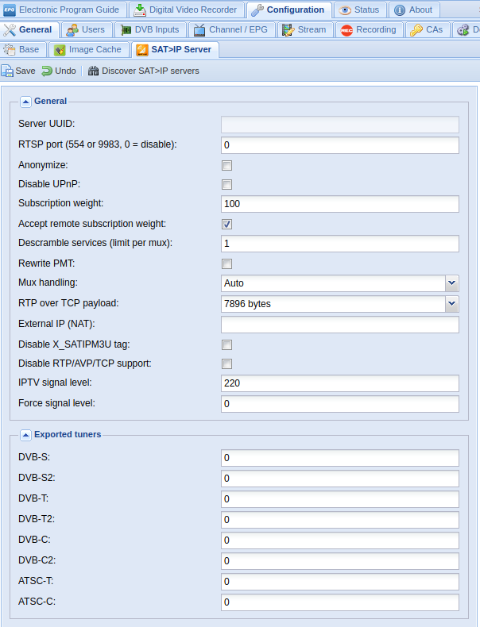



---





* You can put a custom M3U playlist (which will be advertised to clients) in your Tvheadend configuration directory - filename *satip.m3u*.

---

## Buttons



---

## Configure Tvheadend as a SAT>IP Server (Basic Guide)

### 1. Define the RTSP Port

This can be anything you like, it is recommended that you use 9983 
(to avoid permission issues). Entering zero (0) in this field will 
disable the server. 

### 2. Export the Tuners

In the *Exported tuners* section, enter the number of tuners (per 
delivery system) that you'd like to export. This setting lets the 
client know how many tuners are available for use, while you can enter 
any number you like here, exporting more tuners than you have can lead 
to scanning/tuning failures, e.g. "No free tuner".

### 3. Export Your Networks

You must enter a *SAT\>IP source number* for all the 
[networks](class/mpegts_network) you want to export. If you don't export 
any, you will see the following error message (in the log).

`satips: SAT>IP server announces an empty tuner list to a client <IP ADDRESS OF CLIENT> (missing network assignment)` 

The *SAT\>IP source number* is matched through the “src” parameter 
requested by the SAT\>IP client. Usually (and by default) this value 
is 1. For satellite tuners, this value determines the satellite source 
(dish). By specification, position 1 = DiseqC AA, 2 = DiseqC AB, 3 = 
DiseqC BA and 4 = DiseqC BB.

Note that if you use a similar number for multiple 
networks, the first matched network containing the mux with the 
requested parameters will win (also applies to unknown muxes).

### 4. Configure Your Client

Hopefully (and if everything went to plan) your client should have 
now detected Tvheadend as a SAT\>IP server. If not, restart or force 
it to perform a service discovery.

---
