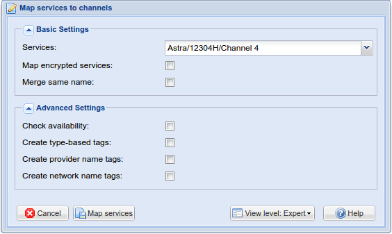



---

## Overview

The map services to channels dialog allows you to control which 
services are mapped. The options selected here get passed to the 
[Service Mapper](status_service_mapper) tab when you press 
the *[Map services]* button.

See [Services](class/mpegts_service) for more details on service mapping.

---

## Buttons



---
