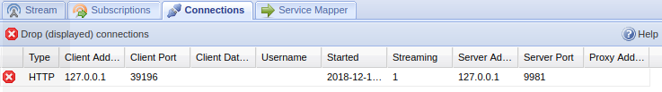

# Status - Connections



---

## Overview

This tab shows information about all active connections.

This is a read-only tab; nothing is configurable.

---

## Buttons



---

## Items

**Cancel Icon **
: Forcefully kill the connection. Note that many applications such as Kodi will automatically reconnect when a connection is dropped.

**Type**
: Connection type - HTSP or HTTP.

**Client Address**
: The IP address of the client device.

**Client Port**
: The port of the client device.

**Client Data Ports**
: The data port(s) used by the client device.

**Username**
: The username used to access Tvheadend (a blank cell indicates no username was supplied).

**Started**
: Date the connection started - YYYY-MM-DD HH:MM:SS.

**Streaming**
: The number of active streams.

**Server Address**
: The address used to connect to the server. This is usually the IP of your device running Tvheadend.

**Proxy Address**
: The IP address of the proxy the client is connecting through (if known).
